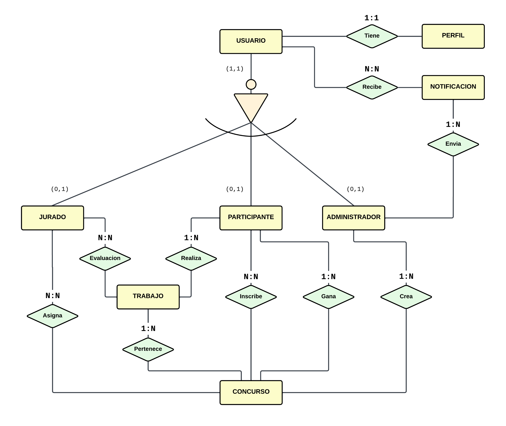

## Modelos del Sistema

---

### Usuario
Representa la cuenta base de todo tipo de usuario en el sistema (participante, jurado o administrador).

**Atributos:**
- `nombre_usuario`: Nombre único de usuario.  
- `correo`: Correo electrónico único.  
- `password`: Contraseña cifrada o en texto (según implementación).  
- `fecha_registro`: Fecha en que el usuario se creó.

**Relaciones:**
- 1:1 con `Perfil` (tiene un perfil).
- Puede recibir muchas `Notificaciones`.

---

### Perfil
Contiene información adicional del usuario.

**Atributos:**
- `usuario`: Relación 1:1 con `Usuario`.  
- `nombre_completo`: Nombre completo.  
- `biografia`: Texto descriptivo opcional.  
- `fecha_nacimiento`: Fecha opcional.  
- `imagen_perfil`: URL o ruta de imagen de perfil.

---

### Jurado
Representa a los usuarios encargados de evaluar los trabajos.

**Atributos:**
- `usuario`: Relación 1:1 con `Usuario`.  
- `experiencia`: Años de experiencia o nivel.  
- `especialidad`: Campo en el que se especializa.  
- `disponible`: Indica si puede evaluar.  
- `puntuacion_media`: Valor promedio de sus evaluaciones.

**Relaciones:**
- N:N con `Concurso` a través de `Asigna` (el jurado es asignado a concursos).  
- N:N con `Trabajo` a través de `Evaluacion` (evalúa trabajos).

---

### Participante
Usuarios que se inscriben en concursos y suben trabajos.

**Atributos:**
- `usuario`: Relación 1:1 con `Usuario`.  
- `alias`: Nombre público o seudónimo.  
- `edad`: Edad del participante.  
- `nivel`: Nivel de experiencia.  
- `puntuacion_total`: Suma de puntuaciones obtenidas.

**Relaciones:**
- 1:N con `Trabajo` (realiza trabajos).  
- N:N con `Concurso` a través de `Inscribe` (se inscribe en concursos).  
- 1:N con `Concurso` (puede ganar concursos).

---

### Administrador
Encargado de crear concursos y enviar notificaciones.

**Atributos:**
- `usuario`: Relación 1:1 con `Usuario`.  
- `area_responsable`: Área que administra.  
- `activo`: Estado del administrador.  
- `fecha_asignacion`: Fecha en que se asignó el rol.  
- `horario_disponible`: Horario de atención o gestión.

**Relaciones:**
- 1:N con `Concurso` (crea concursos).  
- 1:N con `Notificacion` (envía notificaciones).

---

### Notificación
Permite enviar mensajes desde un administrador a varios usuarios.

**Atributos:**
- `autor`: Administrador que la envía.  
- `usuarios`: Usuarios que la reciben (N:N).  
- `titulo`: Título del mensaje.  
- `mensaje`: Cuerpo del mensaje.  
- `fecha_envio`: Fecha de creación/envío.

**Relación intermedia:**  
- Usa la tabla `Recibe` para gestionar el estado de recepción.

---

### Recibe
Tabla intermedia para la relación N:N entre `Usuario` y `Notificacion`.

**Atributos:**
- `usuario`: Usuario receptor.  
- `notificacion`: Notificación recibida.  
- `estado`: Estado del mensaje (`Pendiente` o `Enviada`).  
- `fecha_recepcion`: Fecha en que se registró la recepción.

---

### Concurso
Representa un evento o competencia dentro del sistema.

**Atributos:**
- `nombre`: Nombre del concurso.  
- `descripcion`: Descripción del evento.  
- `fecha_inicio`: Fecha de inicio.  
- `fecha_final`: Fecha de finalización.  
- `activo`: Estado actual (activo o no).  
- `creador`: Administrador que lo creó.  
- `ganador`: Participante que lo ganó.

**Relaciones:**
- N:N con `Participante` (inscripciones mediante `Inscribe`).  
- N:N con `Jurado` (asignaciones mediante `Asigna`).  
- 1:N con `Trabajo` (los trabajos pertenecen a un concurso).

---

### Trabajo
Proyectos o entregas que los participantes suben para concursar.

**Atributos:**
- `participante`: Relación con el autor del trabajo.  
- `concurso`: Concurso al que pertenece.  
- `titulo`: Nombre del trabajo.  
- `descripcion`: Breve explicación.  
- `archivo`: Ruta o nombre del archivo subido.  
- `fecha_envio`: Fecha de envío.  
- `puntuacion_promedio`: Promedio de evaluaciones.

**Relaciones:**
- N:N con `Jurado` mediante `Evaluacion`.

---

### Inscribe
Relación intermedia entre `Participante` y `Concurso`.

**Atributos:**
- `participante`: Usuario participante.  
- `concurso`: Concurso al que se inscribe.  
- `fecha_inscripcion`: Fecha de inscripción.

---

### Asigna
Relación intermedia entre `Jurado` y `Concurso`.

**Atributos:**
- `jurado`: Jurado asignado.  
- `concurso`: Concurso al que fue asignado.  
- `fecha_asignacion`: Fecha de asignación.  
- `activo`: Si la asignación está vigente.

---

### Evaluación
Registra la calificación que un jurado da a un trabajo.

**Atributos:**
- `jurado`: Jurado evaluador.  
- `trabajo`: Trabajo evaluado.  
- `puntuacion`: Nota otorgada.  
- `comentario`: Observaciones del jurado.  
- `fecha_evaluacion`: Fecha en que se realizó.

---

## Esquema Entidad-Relación
A continuación se muestra el diagrama del modelo ER del sistema:

---

[⬅️ Volver al README principal](../README.md)
